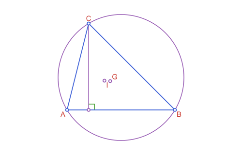
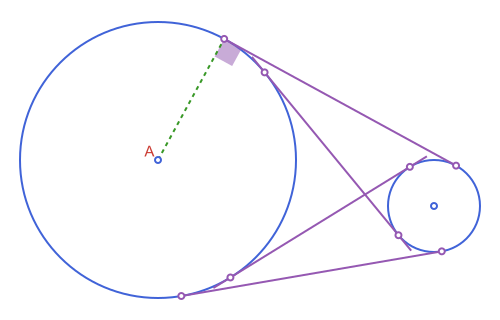

```@meta
CurrentModule = Apollonius
```

# Apollonius.jl

Apollonius.jl is a Julia toolkit for planar Euclidean geometry, and a
system for illustrating it. It gives you real geometric objects (points,
segments, lines, circles, triangles, conics, and the constructions you
build with them: midpoints, intersections, projections, reflections,
rotations, triangle centers, tangency problems) instead of raw numbers.
Because those objects stay geometric all the way through, the same
package can also draw them: load [Luxor.jl](https://github.com/JuliaGraphics/Luxor.jl)
alongside Apollonius and every type here gets a `path` method, plus a
[`@prepare_to_picture`](@ref) macro that sizes and centers a whole figure
for you, so a construction and its illustration come from the same code
instead of two separate ones that can drift apart.

Every exported type is its own struct, prefixed `AP` (`APPoint`, `APCircle2`,
`APTriangle`, ...) and organized into a real abstract type hierarchy, with
genuine "is-a" relationships instead of loose, unrelated structs. More on
that below; first, two examples.

## Example: a triangle and its centers

```@example geo
using Apollonius

a, b, c = APPoint(0.0, 0.0), APPoint(5.0, 0.0), APPoint(1.0, 4.0)
t = APTriangle(a, b, c)
centroid(t)        # center of mass
```

```@example geo
circumcircle(t)    # circle through a, b, c
```

```@example geo
incenter(t)        # center of the inscribed circle
```

```@example geo
l = APLine(a, b)
perpendicular_through(l, c)   # altitude from c
```

```@example geo
intersection(l, circumcircle(t))
```

```@raw html

```


!!! details "See script"

    ```julia
    using Apollonius, Luxor
    import Luxor: julia_red, julia_blue, julia_green, julia_purple

    lxm = @prepare_to_picture! width=500 height=320 margin=30 begin
        a, b, c = APPoint(0.0, 0.0), APPoint(5.0, 0.0), APPoint(1.0, 4.0)
        t = APTriangle(a, b, c)
        circ = circumcircle(t)
        G = centroid(t)
        I = incenter(t)
        foot = projection(c, APLine(a, b))
        height = APSegment(c, foot)
        right = APAngle2(foot, b, c)
    end

    Drawing(lxm.width, lxm.height, :svg)
    Luxor.fontsize(15)
    
    #circle and height
    sethue(julia_purple)
    path([circ, height], action=:stroke)
    
    #angle mark
    sethue(julia_green)
    path(right; as=:rarc, radius=12, action=:stroke)
    
    #triangle
    sethue(julia_blue)
    path(t, action=:stroke)
    
    #points
    sethue("white")
    path([a, b, c], action=:fillpreserve)
    sethue(julia_blue); strokepath()
    sethue("white")
    path([G, I, foot], action=:fillpreserve)
    sethue(julia_purple); strokepath()
    
    #labels 
    sethue(julia_red)
    label("A", :SW, a, offset=8)
    label("B", :SE, b, offset=8)
    label("C", :NW, c, offset=8)
    label("G", :NE, G, offset=8)
    label("I", :SW, I, offset=8)

    finish()
    preview()
    ```


## Example: the same idea, drawn

The four common tangent lines of two circles, sized and centered
automatically by [`@prepare_to_picture`](@ref), with the points of
tangency marked, the angle between the two external tangents shaded, and
one radius dashed in:


```@raw html

```

!!! details "See script"

    ```julia
    using Apollonius, Luxor
    import Luxor: julia_red, julia_blue, julia_green, julia_purple


    lxm, lxo = @prepare_to_picture width=500 height=320 margin=20 begin
        circle1 = APCircle2(APPoint(300.0, 300.0), 300.0)
        circle2 = APCircle2(APPoint(900.0, 200.0), 100.0)
        el1, el2 = external_tangent_lines(circle1, circle2)
        il1, il2 = internal_tangent_lines(circle1, circle2)
        ang = APAngle2(el1.p1, circle1.center, el1.p2)
    end

    (; circle1, circle2, el1, el2, il1, il2, ang) = lxo

    pts = [el1.p1, el1.p2, el2.p1, el2.p2, il1.p1, il1.p2, il2.p1, il2.p2]

    Drawing(lxm.width, lxm.height, :svg)
    origin()

    #circles
    sethue(julia_blue)
    path([circle1, circle2], action = :stroke)

    #radius and angle
    @layer begin
        sethue(julia_green); setdash(:dash)
        path(APSegment(circle1.center, el1.p1), action = :stroke)
        setopacity(0.5)
        path(ang, action = :fill, as = :rsector, radius = 20)
    end

    #lines
    sethue(julia_purple)
    path([il1, il2, el1, el2], action = :stroke)

    sethue(julia_red); setdash(:solid)
    label("A", :NW, circle1.center, offset=8)

    sethue("white")
    path(pts, action=:fillpreserve)
    sethue(julia_purple); strokepath()
    sethue("white")
    path([circle1.center, circle2.center], action=:fillpreserve)
    sethue(julia_blue); strokepath()
    finish()
    preview()
    ```

Everything here (the circles, the tangent lines, the angle, the points)
is a real Apollonius object right up until it's drawn. `external_tangent_lines`
and `internal_tangent_lines` are ordinary geometry functions, usable on
their own with no Luxor loaded at all. Continue to
[Drawing with Luxor.jl](@ref) for the full picture: how `@prepare_to_picture`
works, what `path` draws for each type, and the rest of the drawing-side
functions.

## The type hierarchy

```
APObject{Dim,T}
├── APLocus{Dim,T}
│   ├── APCurve{Dim,T}
│   │   ├── APLine{Dim,T}
│   │   ├── APRay{Dim,T}
│   │   ├── APSegment{Dim,T}
│   │   ├── APPolyline2{T}
│   │   ├── APCurvilinearPolyline2{T}
│   │   ├── APEquipollentVector{Dim,T}
│   │   ├── APParametricCurve2{T}
│   │   ├── APConic2{T}
│   │   │   ├── APCircle2{T}
│   │   │   ├── APEllipse2{T}
│   │   │   ├── APParabola2{T}
│   │   │   └── APHyperbola2{T}
│   │   └── APConicArc2{T}
│   │       ├── APCircularArc2{T}
│   │       ├── APEllipticArc2{T}
│   │       ├── APParabolicArc2{T}
│   │       └── APHyperbolicArc2{T}
│   └── APSet{Dim,T}
│       ├── APHalfPlane2{T}
│       ├── APAngle2{T}
│       ├── APStrip2{T}
│       └── APRegion{Dim,T}
│           └── APPolygon{Dim,T}
│               ├── APTriangle{Dim,T}
│               ├── APQuadrilateral{Dim,T}
│               ├── APStraightNgon{Dim,T}
│               ├── APCircularSector2{T}
│               ├── APCircularSegment2{T}
│               ├── APAnnularSector2{T}
│               ├── APInterstice2{T}
│               ├── APCurvilinearTriangle2{T}
│               ├── APCurvilinearQuadrilateral2{T}
│               └── APCurvilinearNgon2{T}
├── APPoint{Dim,T}
├── APVector{Dim,T}
└── APBoundingBox{Dim,T}

APTransform{T}
└── APAffineMap{T}
```

`APTriangle`, `APQuadrilateral`, `APCircularSector2` and every other
closed shape is an [`APPolygon`](@ref), so
`area`/`perimeter`/`centroid`/`is_convex`/`point_in_polygon` are defined
once, generically, not reimplemented per type. See each abstract type's
own docstring ([`APObject`](@ref), [`APLocus`](@ref), [`APCurve`](@ref),
[`APSet`](@ref), [`APRegion`](@ref), [`APPolygon`](@ref),
[`APTransform`](@ref)) for what belongs where and why.

```julia
t = APTriangle(APPoint(0.0, 0.0), APPoint(1.0, 0.0), APPoint(0.0, 1.0))
t isa APPolygon, t isa APRegion, t isa APSet, t isa APLocus, t isa APObject   # (true, true, true, true, true)

s = APSegment(APPoint(0.0, 0.0), APPoint(1.0, 1.0))
s isa APCurve, s isa APLocus                                                  # (true, true): not an APRegion, a segment isn't a closed shape

ang = APAngle2(APPoint(0.0, 0.0), APPoint(1.0, 0.0), APPoint(0.0, 1.0))
ang isa APSet, ang isa APRegion   # (true, false): unbounded, so an APSet but not an APRegion

m = APAffineMap(1.0, 0.0, 0.0, 1.0, 0.0, 0.0)
m isa APTransform, m isa APObject   # (true, false): APTransform is its own separate hierarchy
```

## Where to go next

* [Conventions & FAQ](@ref) for angles, orientation, naming, `==` versus
  `≈`, and the two rules that govern drawing.
* [Workflow: From Construction to Figure](@ref) for the order of the steps
  that turns a construction into a figure, and what goes wrong when it is
  broken.
* [Drawing with Luxor.jl](@ref) for `path`, `@prepare_to_picture`, and
  everything else this package adds for illustration.
* [Marks, Labels & Decorations](@ref) for equality marks, arrowheads,
  braces, label placement, guides and grids, and
  [Compass & Ruler Constructions](@ref) for figures that show the
  compass traces.
* [Points, Lines & Rays: Creating Them](@ref), [Circles: Basics](@ref),
  [Triangles: The Classical Centers](@ref), [Tangency & Apollonius Problems](@ref),
  [Polygons: Measurements & Operations](@ref) and
  [Conics: Ellipse, Parabola & Hyperbola](@ref) for a guided tour of the
  geometry itself, with worked examples.
* [Unbounded Regions: Half-Planes, Strips & Angles](@ref), [Affine Maps](@ref) and
  [Macros: Transforming Shapes](@ref) for half-planes and strips, the
  affine transformations, and the macros that apply a transform to a whole
  block of shapes.
* The [README](https://github.com/gxono/Apollonius.jl#readme) for the
  short version, and [API Reference](@ref) for every exported function
  and type.
