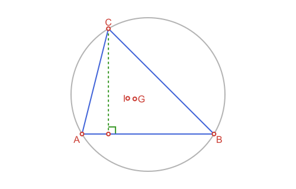
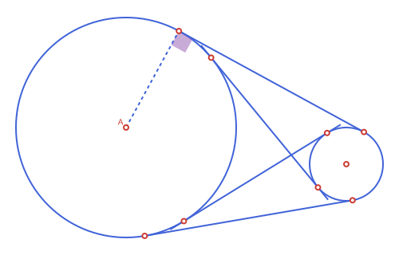

```@meta
CurrentModule = Apollonius
```

# Apollonius.jl

!!! note "Illustrations are still on their way"
    Several pages on this site have a placeholder image (labeled "TODO:
    diagram") standing in for a real illustration. The text and code
    examples around them are complete and verified; the actual diagrams
    will be filled in over time.

Documentation for [Apollonius.jl](https://github.com/gxono/Apollonius.jl), a Julia toolkit for planar Euclidean geometry — points, segments, lines, rays, circles and triangles, plus the constructions you build with them (midpoints, intersections, projections, reflections, rotations, triangle centers, tangency, conics...).

Every exported type is its own struct, prefixed `AP` (`APPoint`, `APCircle2`,
`APTriangle`, ...) and organized into a real abstract type hierarchy — no
external geometry dependency, and genuine "is-a" relationships instead of
loose, unrelated structs:

```
APObject{Dim,T}
├── APLocus{Dim,T}
│   ├── APCurve{Dim,T}
│   │   ├── APLine{Dim,T}
│   │   ├── APRay{Dim,T}
│   │   ├── APSegment{Dim,T}
│   │   ├── APConic2{T}                       -- circle, ellipse, parabola, hyperbola
│   │   │   ├── APCircle2{T}
│   │   │   ├── APEllipse2{T}
│   │   │   ├── APParabola2{T}
│   │   │   └── APHyperbola2{T}
│   │   └── APConicArc2{T}                    -- a bounded piece of one of the conics above
│   │       ├── APCircularArc2{T}
│   │       ├── APEllipticArc2{T}
│   │       ├── APParabolicArc2{T}
│   │       └── APHyperbolicArc2{T}
│   └── APSet{Dim,T}
│       ├── APHalfPlane2{T}
│       ├── APAngle2{T}
│       ├── APStrip2{T}
│       └── APRegion{Dim,T}
│           └── APPolygon{Dim,T}
│               ├── APTriangle{Dim,T}
│               ├── APQuadrilateral{Dim,T}
│               ├── APStraightNgon{Dim,T}
│               ├── APCircularSector2{T}
│               ├── APCircularSegment2{T}
│               ├── APAnnularSector2{T}
│               ├── APInterstice2{T}
│               ├── APCurvilinearTriangle2{T}
│               ├── APCurvilinearQuadrilateral2{T}
│               └── APCurvilinearNgon2{T}
├── APPoint{Dim,T}
├── APVector{Dim,T}
└── APBoundingBox{Dim,T}

APTransform{T}
└── APAffineMap{T}
```

**Why a custom type hierarchy at all**, rather than building on an
existing geometry package: two concrete problems, both hit in practice
while this package still built on GeometryBasics.jl.

1. **Naming collisions.** GeometryBasics.jl exports `Point`, `Circle`,
   `Triangle`, `Polygon`, `BoundingBox`... — names that also collide with
   [Luxor.jl](https://github.com/JuliaGraphics/Luxor.jl)'s own `Point`,
   `Circle`, `BoundingBox`, etc. Since drawing (the main reason to load
   both packages together) needs exactly that combination, every call
   needed explicit qualification to say which package's type was meant.
   Every type here is prefixed `AP`, so it never collides with anything.
2. **No real "is-a" relationships.** With loose, unrelated structs, a
   `Triangle` couldn't be treated as a `Polygon` even though it obviously
   is one — so shared logic (`area`, `perimeter`, `centroid`, ...) had to
   be reimplemented separately per shape, and a function that legitimately
   wants "any closed region" had no single type to accept. With a genuine
   abstract hierarchy — every closed shape really `<: APPolygon` — that
   logic is written **once**, generically, via `sides()` and a shared
   Green's-theorem line integral; a brand new shape (`APCurvilinearNgon2`,
   `APAnnularSector2`, ...) gets `area`/`perimeter`/`centroid`/`is_convex`/
   `point_in_polygon` for free just by implementing `sides()`.

The practical upshot: `APTriangle`, `APQuadrilateral`, `APCircularSector2`
and every other closed shape genuinely *is* an [`APPolygon`](@ref), so
`area`/`perimeter`/`centroid`/`is_convex`/`point_in_polygon` are defined
**once**, generically — not reimplemented per type. See each abstract
type's own docstring ([`APObject`](@ref), [`APLocus`](@ref),
[`APCurve`](@ref), [`APSet`](@ref), [`APRegion`](@ref),
[`APPolygon`](@ref), [`APTransform`](@ref)) for what belongs where and why.

```julia
t = APTriangle(APPoint(0.0, 0.0), APPoint(1.0, 0.0), APPoint(0.0, 1.0))
t isa APPolygon, t isa APRegion, t isa APSet, t isa APLocus, t isa APObject   # (true, true, true, true, true)

s = APSegment(APPoint(0.0, 0.0), APPoint(1.0, 1.0))
s isa APCurve, s isa APLocus                                                  # (true, true) -- not an APRegion: a segment isn't a closed shape

ang = APAngle2(APPoint(0.0, 0.0), APPoint(1.0, 0.0), APPoint(0.0, 1.0))
ang isa APSet, ang isa APRegion   # (true, false) -- unbounded, so an APSet but not an APRegion

m = APAffineMap(1.0, 0.0, 0.0, 1.0, 0.0, 0.0)
m isa APTransform, m isa APObject   # (true, false) -- APTransform is its own separate hierarchy
```

See the [README](https://github.com/gxono/Apollonius.jl#readme) for the full feature overview, and the [API Reference](@ref) for every exported function and type. For a guided tour with explanations and worked examples, start with:

* [Points, Lines & Rays](@ref)
* [Circles](@ref)
* [Triangles & Triangle Centers](@ref)
* [Tangency & Apollonius Problems](@ref)
* [Polygons & Bounding Boxes](@ref)
* [Conics: Ellipse, Parabola & Hyperbola](@ref)
* [Affine Maps](@ref)

## Quick example

```@example geo
using Apollonius

a, b, c = APPoint(0.0, 0.0), APPoint(5.0, 0.0), APPoint(1.0, 4.0)
t = APTriangle(a, b, c)
centroid(t)        # center of mass
```

```@example geo
circumcircle(t)    # circle through a, b, c
```

```@example geo
incenter(t)        # center of the inscribed circle
```

```@example geo
l = APLine(a, b)
perpendicular_through(l, c)   # altitude from c
```

```@example geo
intersection(l, circumcircle(t))
```

```@raw html

```

## Figures, via Luxor.jl

This package doesn't depend on [Luxor.jl](https://github.com/JuliaGraphics/Luxor.jl),
but if you load both, a [`path`](@ref) function becomes available for
every type here, via a package extension, plus [`@to_luxor_picture`](@ref)
and [`current_path_bbox`](@ref) for sizing/positioning a `Drawing`
automatically instead of guessing coordinates by hand. The point of all
of it is exactly what this documentation itself needs: it's the tool
this site's own illustrations (once filled in, see the note above) get
built with. See [Drawing with Luxor.jl](@ref) at the end of this site for
the full rundown.

A quick taste — the four common tangent lines of two circles, sized and
centered automatically by [`@to_luxor_picture!`](@ref), with the points
of tangency picked out, the angle between the two external tangents
shaded, and one radius dashed in:

```julia
using Apollonius
using Luxor: @svg, sethue, setdash, setopacity,
     fillpreserve, strokepath,
    julia_blue, julia_green, julia_red, julia_purple,
    gsave, grestore
import Luxor

sz = @to_luxor_picture! width=500 height=320 margin=20 begin
    circle1 = APCircle2((300,300), 300)
    circle2 = APCircle2((900,200), 100)
    el1, el2 = external_tangent_lines(circle1, circle2)
    il1, il2 = internal_tangent_lines(circle1, circle2)
    ang = APAngle2(el1.p1, circle1.center, el1.p2)
end

pts = [el1.p1, el1.p2, el2.p1, el2.p2, il1.p1, il1.p2, il2.p1, il2.p2]

@svg begin
    sethue(julia_blue)
    path(circle1, action = :stroke)
    path(circle2, action = :stroke)

    gsave()
        sethue(julia_purple)
        setopacity(0.5)
        path(ang, action = :fill, as = :rsector, radius = 20)
    grestore()

    path([il1, il2], action = :stroke, extend = 20)
    path([el1, el2], action = :stroke, extend = 0)

    gsave()
        setdash(:dash)
        path(APSegment(circle1.center, el1.p1), action = :stroke)
    grestore()

    path(pts)
    path([circle1.center, circle2.center])
    sethue("white"); fillpreserve()
    sethue(julia_red); strokepath()

    label("A", :NW, circle1.center)
end sz.width sz.height
```

```@raw html

```
