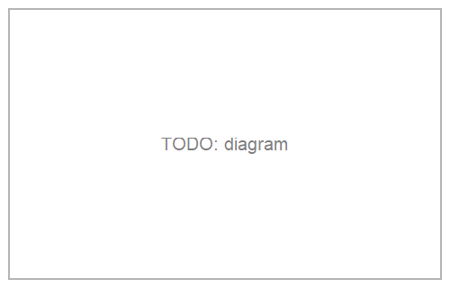

```@meta
CurrentModule = EuclideanGeometry
```

# Transforming in Bulk: Macros

Applying the same transform to several shapes one at a time is repetitive:
`c2 = rotate(c, angle); s2 = rotate(s, angle); t2 = rotate(t, angle)`. Every
transform in the package ([`translate`](@ref), [`rotate`](@ref),
[`homothety`](@ref), [`reflection`](@ref), [`invert`](@ref)/
[`invert_neg`](@ref), and [`EGAffineMap`](@ref) application) has a matching
macro that instead takes a whole `begin ... end` block naming several
shapes at once, applies the transform to each, and returns the results
together as a tuple — plus a mutating `!` counterpart that rebinds each
shape's own variable instead of returning a copy. [`@boundingbox`](@ref)
follows the same block syntax to build the one box around everything
listed, rather than applying a transform.

| Macro | Transform applied | Mutating form |
|:------|:-------------------|:--------------|
| [`@boundingbox`](@ref) | — (builds one [`EGBoundingBox`](@ref) around everything) | — |
| [`@translate`](@ref) | [`translate`](@ref) | [`@translate!`](@ref) |
| [`@rotate`](@ref) | [`rotate`](@ref) | [`@rotate!`](@ref) |
| [`@homothety`](@ref) | [`homothety`](@ref) | [`@homothety!`](@ref) |
| [`@reflection`](@ref) | [`reflection`](@ref) | [`@reflection!`](@ref) |
| [`@invert`](@ref) | [`invert`](@ref) | [`@invert!`](@ref) |
| [`@invert_neg`](@ref) | [`invert_neg`](@ref) | [`@invert_neg!`](@ref) |
| [`@affinemap`](@ref) | any [`EGAffineMap`](@ref) | [`@affinemap!`](@ref) |



## Reading the block

Every one of these macros reads its `begin ... end` block the same way,
top to bottom, as ordinary code (not a new scope — there's no `let`):

* an **assignment** `name = expr` runs as written, and `name`'s value is
  the one transformed;
* a **bare expression** — most often the name of a shape defined earlier,
  outside the block or on an earlier line inside it — has its value
  transformed directly, with nothing (re)assigned.

A single shape/expression instead of a full block also works
(`@rotate angle c`), treated as a one-line block; with only one item, the
result is returned bare rather than wrapped in a 1-tuple.

```@example geo
using EuclideanGeometry

c = EGCircle2(EGPoint(1.0, 2.0), 3.0)
s = EGSegment(EGPoint(0.0, 0.0), EGPoint(4.0, 0.0))

C2, S2 = @rotate (pi / 2) begin
    c
    s
end
C2, S2
```

## `@boundingbox`

Builds one [`EGBoundingBox`](@ref) around every shape listed — shorthand
for `reduce(bbox_union, EGBoundingBox.(shapes))`, [`bbox_union`](@ref)
itself being the box around two boxes:

```@example geo
t = EGTriangle(EGPoint(0.0, 0.0), EGPoint(5.0, 1.0), EGPoint(2.0, 4.0))
circ = EGCircle2(EGPoint(-1.0, -1.0), 1.5)

@boundingbox begin
    t
    circ
end
```

```@example geo
bbox_union(EGBoundingBox(t), EGBoundingBox(circ))   # exactly what @boundingbox computed above
```

Blocks like this often mix in plain construction helpers alongside the
actual shapes — a center point, a radius, a scalar computed along the
way. `EGBoundingBox` handles every one of those without erroring:

  - a bare [`EGPoint`](@ref) gets its own degenerate (zero-size) box at
    its own location — a point *is* a position, so it grows a
    [`bbox_union`](@ref) exactly like any other shape;
  - a plain number, an [`EGVector`](@ref) (a direction, not a location),
    or an unbounded curve/region (`EGLine`, `EGRay`, `EGAngle2`,
    `EGHalfPlane2`, `EGStrip2`) has no position of its own to report, so
    `EGBoundingBox` returns the *empty* box for these instead — the
    identity element for `bbox_union`, so combining it with anything else
    just returns that other box unchanged:

```@example geo
centro = EGPoint(2.0, 1.0)
radio = 5.0

@boundingbox begin
    centro
    radio
end
```

```@example geo
isempty(EGBoundingBox(radio)), bbox_union(EGBoundingBox(radio), EGBoundingBox(centro)) == EGBoundingBox(centro)
```

An empty block is an `ArgumentError` — there's no box to build:

```@example geo
try
    @boundingbox begin end
catch e
    e
end
```

## `@to_luxor_picture` / `@to_luxor_picture!`

Preparing a set of shapes to actually *draw* usually means answering three
fiddly questions by hand: how big is this thing, how far do I need to
shift it so it isn't half off-canvas, and what canvas size do I even pass
to `Drawing`? [`@to_luxor_picture`](@ref) answers all three in one call:
it translates and uniformly scales every shape in the block so their
combined [`EGBoundingBox`](@ref) fits centered on `(0, 0)`, and returns
the exact canvas size alongside the transformed shapes. Centering on
`(0, 0)` matches Luxor's own `origin()` convention, so the result is
ready to draw right after `origin()` — which `@png`/`@svg`/`@pdf` already
call for you. Despite the name, this macro is plain geometry — it has no
Luxor dependency at all; see [Drawing with Luxor.jl](@ref) for the full
`Drawing`/`path`/`finish` workflow this is designed to feed directly.

```@example geo
c = EGCircle2(EGPoint(3.0, -1.0), 5.0)
s = EGSegment(EGPoint(-2.0, 4.0), EGPoint(6.0, -3.0))

(w, h), (c2, s2) = @to_luxor_picture begin
    c
    s
end
(w, h)   # the combined bbox is already 10x10, so this is its natural size
```

```@example geo
c2, s2   # translated so the combined bbox is centered on (0, 0)
```

`c`/`s` themselves are untouched (see [`@to_luxor_picture!`](@ref) below
for the mutating form); the block is read exactly like
[`@boundingbox`](@ref)'s (an assignment binds `name` as usual, a bare
expression contributes without binding anything, and a single
shape/expression works without `begin`/`end` too) — including how
construction helpers are handled: a bare [`EGPoint`](@ref) is repositioned
along with everything else (it's a real position), while a plain number,
an [`EGVector`](@ref), or an unbounded shape is left completely untouched
(there's no position to move, and a number in particular isn't the kind
of value `translate`/`homothety` know how to transform):

```@example geo
centro = EGPoint(2.0, 1.0)
radio = 5.0
circ2 = EGCircle2(centro, radio)

(w, h), (centro2, radio2, c2) = @to_luxor_picture width = 400.0 begin
    centro
    radio
    circ2
end
radio2 == radio, centro2   # radio2 untouched; centro2 repositioned like circ2
```

A block with nothing but such non-positional values is an `ArgumentError`
too — there's no finite content to size a canvas around.

### Sizing options

| Option | Effect |
|:-------|:-------|
| *(none)* | scale factor `1.0` — the shapes' own coordinate units become output units directly |
| `scale` | a literal, uniform multiplier |
| `width` (alone) | scaled so the content's width comes out exactly `width` minus `margin`; height follows to preserve the aspect ratio |
| `height` (alone) | symmetric |
| `width` *and* `height` | a "contain" fit: scaled by whichever of the two is more restrictive, so the content fits inside *both* without distortion |
| `margin` | blank space guaranteed around the content on every side (default `0.0`) |

`scale` and `width`/`height` are mutually exclusive — combining them is an
error. The scale factor is **always** the same in `x` and `y`: a circle
passed through `@to_luxor_picture` is always still a circle, never
distorted into an ellipse, no matter which sizing option is used.

```@example geo
c, s = EGCircle2(EGPoint(3.0, -1.0), 5.0), EGSegment(EGPoint(-2.0, 4.0), EGPoint(6.0, -3.0))
(w, h), _ = @to_luxor_picture width=400.0 begin
    c
    s
end
(w, h)   # height follows to keep the (here already square) aspect ratio
```

```@example geo
c, s = EGCircle2(EGPoint(3.0, -1.0), 5.0), EGSegment(EGPoint(-2.0, 4.0), EGPoint(6.0, -3.0))
(w, h), _ = @to_luxor_picture scale=2.0 begin
    c
    s
end
(w, h)   # canvas size is derived from the scaled content, not requested
```

When `width` and `height` are given together and don't match the
content's own aspect ratio, the content is scaled by whichever bound is
more restrictive and *centered* in the requested canvas — extra blank
space (beyond `margin`) lands on whichever axis has slack, rather than
stretching the content to fill it:

```@example geo
t = EGTriangle(EGPoint(0.0, 0.0), EGPoint(6.0, 0.0), EGPoint(3.0, 5.0))
circ = EGCircle2(EGPoint(3.0, 2.0), 1.5)

(w, h), (t2, circ2) = @to_luxor_picture width=400.0 height=200.0 margin=10.0 begin
    t
    circ
end
(w, h), circ2   # circ2 is still an EGCircle2 -- never distorted
```

`margin` works the same way whether or not `width`/`height` are given —
with neither, it simply pads the content's own natural size on every side:

```@example geo
c, s = EGCircle2(EGPoint(3.0, -1.0), 5.0), EGSegment(EGPoint(-2.0, 4.0), EGPoint(6.0, -3.0))
(w, h), _ = @to_luxor_picture margin=3.0 begin
    c
    s
end
(w, h)   # the natural 10x10 size, padded by 3 on every side
```

Combining `scale` with `width`/`height` is an error — raised as soon as
the macro call itself is expanded, before any of the block even runs:

```@example geo
try
    eval(:(@to_luxor_picture scale=2.0 width=10.0 c))
catch e
    e
end
```

### `@to_luxor_picture!`

The mutating counterpart: rebinds each *named* shape (an assignment, or a
bare reference to a shape defined earlier) to its own translated/scaled
image, instead of returning copies — the same relationship
[`@translate!`](@ref) has to [`@translate`](@ref). Since the shapes are
already accessible under their own names afterward, it returns just
`(width, height)`:

```@example geo
c3 = EGCircle2(EGPoint(3.0, -1.0), 5.0)
s3 = EGSegment(EGPoint(-2.0, 4.0), EGPoint(6.0, -3.0))

(w, h) = @to_luxor_picture! width=50.0 begin
    c3
    s3
end
(w, h), c3, s3   # c3/s3 themselves now refer to the translated/scaled shapes
```

A bare, unnamed expression has nothing to rebind, so this form rejects it
(same as `@translate!` and the rest of that family) — see
[Drawing with Luxor.jl](@ref) for the complete pipeline, from a bare set
of `EGPoint`/`EGTriangle`/etc. all the way to a finished PNG.

## `@translate` / `@translate!`

```@example geo
v = EGVector(2.0, -1.0)

T1, S1 = @translate v begin
    t
    s
end
T1
```

`t`/`s` themselves are untouched by `@translate` — `@translate!` instead
rebinds each *named* shape's own variable to its translated image (the
object itself never mutates, since these are all immutable structs; only
the variable is repointed, the same trick `Setfield.jl`'s `@set!` uses):

```@example geo
t3 = EGTriangle(EGPoint(0.0, 0.0), EGPoint(1.0, 0.0), EGPoint(0.0, 1.0))
@translate! v t3
t3   # t3 itself now refers to the translated triangle
```

A bare, unnamed expression has nothing to rebind, so the mutating forms
reject it:

```@example geo
try
    @translate! v begin
        EGPoint(0.0, 0.0)   # not assigned to a name
    end
catch e
    e
end
```

## `@rotate` / `@rotate!`

Takes an optional `center` (defaults to the origin, exactly like
[`rotate`](@ref) itself):

```@example geo
R1, R2 = @rotate (pi / 2) EGPoint(1.0, 1.0) begin
    t
    circ
end
R1
```

```@example geo
t4 = EGTriangle(EGPoint(0.0, 0.0), EGPoint(1.0, 0.0), EGPoint(0.0, 1.0))
@rotate! (pi / 2) t4
t4
```

## `@homothety` / `@homothety!`

Also takes an optional `center` (default: the origin):

```@example geo
H1, H2 = @homothety 2.0 begin
    t
    circ
end
H1
```

```@example geo
t5 = EGTriangle(EGPoint(0.0, 0.0), EGPoint(1.0, 0.0), EGPoint(0.0, 1.0))
@homothety! (-1.0) EGPoint(0.5, 0.5) t5   # a point reflection through (0.5, 0.5)
t5
```

## `@reflection` / `@reflection!`

`about` a point or a line, same as [`reflection`](@ref) itself:

```@example geo
mirror = EGLine(EGPoint(0.0, 0.0), EGPoint(1.0, 1.0))

M1, M2 = @reflection mirror begin
    t
    circ
end
M1
```

```@example geo
t6 = EGTriangle(EGPoint(0.0, 0.0), EGPoint(1.0, 0.0), EGPoint(0.0, 1.0))
@reflection! EGPoint(2.0, 2.0) t6
t6
```

## `@invert` / `@invert!` and `@invert_neg` / `@invert_neg!`

[`invert`](@ref)/[`invert_neg`](@ref) with respect to the circle centered
at `center` (radius `k`, defaulting to `1.0`) — note that inversion can
change a shape's own *type* (an `EGLine` not through `center` inverts to
an `EGCircle2`, and vice versa), no different here:

```@example geo
center = EGPoint(0.0, 0.0)
far_line = EGLine(EGPoint(2.0, 0.0), EGPoint(2.0, 1.0))

I1, I2 = @invert center 3.0 begin
    far_line
    circ
end
I1   # an EGCircle2: far_line doesn't pass through center
```

`@invert!` is the mutating form, exactly like every other macro's `!`
counterpart:

```@example geo
near_line = EGLine(EGPoint(0.5, 0.0), EGPoint(0.5, 1.0))
@invert! center 3.0 near_line
near_line   # rebound to its own inverted image
```

`@invert_neg` is the negative-ratio counterpart, used the same way:

```@example geo
far_line2 = EGLine(EGPoint(2.0, 0.0), EGPoint(2.0, 1.0))
@invert_neg! center far_line2
far_line2
```

## `@affinemap` / `@affinemap!`

Applies any [`EGAffineMap`](@ref) `m`, exactly like calling `m(shape)`
by hand — see [Affine Maps](@ref) for how `m` itself is built:

```@example geo
m = EGAffineMap(1.3, 0.4, -0.2, 0.9, 0.0, 0.0)

T7, C7 = @affinemap m begin
    t
    circ
end
T7   # circ, being non-similarity-mapped, would come back as an EGEllipse2 — see Affine Maps
```

```@example geo
t8 = EGTriangle(EGPoint(0.0, 0.0), EGPoint(1.0, 0.0), EGPoint(0.0, 1.0))
@affinemap! m t8
t8
```

## Embedding a macro call inside another expression

When a call to any of these (besides `@boundingbox`, which only takes one
argument before the block) appears as an *argument* to something else —
not its own statement — wrap it in parentheses:

```julia
f((@rotate angle p), other_arg)    # correct
f(@rotate angle p, other_arg)      # wrong: swallows other_arg into the macro call
```

This is a general rule for any multi-argument macro call in Julia (a bare
`@macro arg1 arg2` swallows comma-separated arguments that follow), not
specific to this package — a plain statement like `x = @rotate angle p`
never runs into it.
