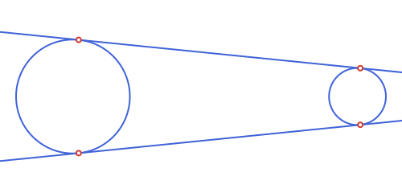
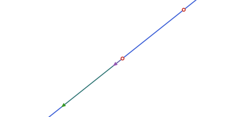
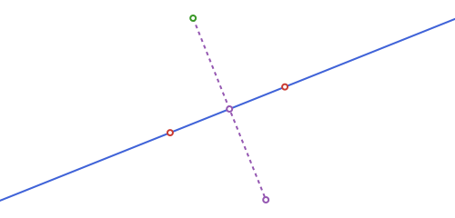

```@meta
CurrentModule = EuclideanGeometry
```

# Points, Lines & Rays

These are the building blocks everything else in the package is made of.

* A **point** is [`EGPoint`](@ref), and a **vector** (a free direction, with
  no fixed location) is the separate type [`EGVector`](@ref). Both wrap the
  same `(x, y)` coordinate pair, but keeping them distinct means `EGVector`
  can carry its own meaning (a *direction*, e.g. what
  [`direction`](@ref) returns) without being confused for a location.
  Arithmetic between them stays permissive on purpose: `EGPoint - EGPoint`
  still gives back an `EGPoint` (not a vector), so familiar formulas like
  `2*about - p` keep working exactly as before — see the table below.
* A **segment** is a finite piece of straight line between two points:
  [`EGSegment`](@ref).
* A **line** ([`EGLine`](@ref)) is the *infinite* straight line through two
  points, and a **ray** ([`EGRay`](@ref)) is the *half-line* starting at an
  origin and passing through a second point. Both are small immutable
  structs holding the two defining points.

All four are part of the package's own EG-prefixed type hierarchy (see
[EuclideanGeometry.jl](@ref) for the full tree): `EGPoint`/`EGVector` sit directly under
`EGObject`, while `EGSegment`/`EGLine`/`EGRay` are all `EGCurve`s.

| Type | Represents | Fields |
|:-----|:-----------|:-------|
| [`EGPoint`](@ref) | a point in the plane | `p[1]`, `p[2]` (x, y) |
| [`EGVector`](@ref) | a free direction/displacement | `v[1]`, `v[2]` (x, y) |
| [`EGSegment`](@ref) | the segment `[p1, p2]` | `s[1]`, `s[2]` (also `.p1`, `.p2`) |
| [`EGLine`](@ref) | the infinite line through `p1`, `p2` | `l[1]`, `l[2]` (also `.p1`, `.p2`) |
| [`EGRay`](@ref) | the half-line from `origin` through `through` | `r[1]`, `r[2]` (also `.origin`, `.through`) |

None of `EGSegment`/`EGLine`/`EGRay` carry a direction *magnitude* — an
`EGLine` through `p1` and `p2` is the same object as the line through `p2`
and `p1` — but `EGSegment` and `EGRay` do remember which of their two
points comes first, since that is what makes them finite/one-sided in the
first place.

`EGPoint`/`EGVector`/`EGSegment`/`EGLine`/`EGRay` all support
**destructuring** (`x, y = p`, `p1, p2 = s`) for convenience — including
flattening a whole collection of them into their defining points at once,
via `Iterators.flatten`:

```@example geo
using EuclideanGeometry

c1, c2 = EGCircle2(EGPoint(0.0, 0.0), 2.0), EGCircle2(EGPoint(10.0, 0.0), 1.0)
l1, l2 = external_tangent_lines(c1, c2)
collect(Iterators.flatten([l1, l2]))   # the 4 points of tangency, in one Vector{EGPoint}
```

```@raw html

```

But every `EGObject`/`EGTransform` (this one included) is always a
*scalar* for **broadcasting** purposes, so `translate.(p, [v1, v2])` or
`intersection.(l, [c1, c2])` repeats the single shape against each
element of the other argument, rather than Julia's usual `f.(x)`
mistaking an iterable `x` for a collection to broadcast over its own
components.

## Creating them

```@example geo
using EuclideanGeometry

A = EGPoint(3.0, 4.0)
O = EGPoint(0.0, 0.0)

s = EGSegment(O, A)     # the segment from O to A
l = EGLine(O, A)        # the infinite line through O and A
r = EGRay(O, A)         # the half-line starting at O, through A

distance(O, A)
```

`distance(O, A)` is `5.0`: with `A = (3, 4)`, this is just the classic
3-4-5 triangle. `EGSegment`, `EGLine` and `EGRay` all wrap the *same* two
points here — what differs is only how far they extend and what other
functions are willing to do with them (e.g. [`on_segment`](@ref) only
makes sense for an `EGSegment`, [`slope_angle`](@ref) treats `EGLine` and
`EGRay` as pointing one way and an `EGSegment` as pointing from its first
point to its second).

### Plain tuples instead of `EGPoint`

Spelling out `EGPoint(...)` for every point gets repetitive once several
constructors are chained together, so every constructor that takes a
point also accepts a plain tuple `(x, y)` in its place — anywhere you see
`::EGPoint` in a signature throughout this package, a bare tuple works too:

```@example geo
EGSegment((0.0, 0.0), (3.0, 4.0)) == EGSegment(EGPoint(0.0, 0.0), EGPoint(3.0, 4.0))
```

```@example geo
EGCircle2((1.0, 2.0), 5.0)    # same as EGCircle2(EGPoint(1.0, 2.0), 5.0)
```

Tuples and `EGPoint`s mix freely in the same call, and a mixed-element
tuple like `(5, 10.0)` promotes exactly like `EGPoint(5, 10.0)` does:

```@example geo
EGSegment(EGPoint(0, 0), (3, 4.0))    # one EGPoint arg, one tuple arg — both fine together
```

This is purely notational — `EGPoint(t::Tuple)` (or `_topoint` internally,
for every other constructor) converts the tuple up front, so there is no
separate "tuple mode" to reason about afterward: the object you get back
is a perfectly ordinary `EGPoint`/`EGSegment`/`EGCircle2`/etc., identical
to what you'd get by spelling out `EGPoint(...)` yourself.

## Points vs. vectors

A point minus a point is *still a point*, not a vector — `A - O` above
stays an `EGPoint`. This is a deliberate choice: it keeps existing
point-arithmetic formulas (like a reflection written as `2*about - p`)
working exactly as they read, without forcing every subtraction through a
vector type first. Where a genuine *direction* is called for — the
result of [`direction`](@ref) below, for instance — the package hands
back an actual [`EGVector`](@ref) instead:

```@example geo
d = direction(l)    # an EGVector, not an EGPoint
typeof(d)
```

Both types support the same arithmetic and the standard linear-algebra
functions `norm`, `dot` and `normalize` — re-exported from `LinearAlgebra`
purely so `using EuclideanGeometry` alone is enough to get the full
vector toolkit, without a separate `using LinearAlgebra`:

```@example geo
norm(d)        # 5.0
normalize(d)   # (0.6, 0.8): unit vector, same direction
dot(d, EGVector(1.0, 0.0))   # 3.0
```

### Giving a vector a position: `EGEquipollentVector`

An `EGVector` is deliberately positionless — that's exactly what makes it
the right type for `direction(l)`, a normal, or anything else that's
purely "which way and how far," never "where." But that same
positionlessness means a bare `EGVector` has no [`EGBoundingBox`](@ref) at
all (`isempty(EGBoundingBox(::EGVector))` is always `true`), so it's
entirely exempt from [`@to_luxor_picture`](@ref)'s fit-to-canvas transform
— drawing one directly inside a picture comes out at the wrong scale and
anchored at the wrong place, since it never got scaled/shifted/flipped
along with everything else in the block.

[`EGEquipollentVector`](@ref) (the classical "vector equipolente": a
representative of a free vector, tied to a point of application) is the
fix — it wraps a `vector` and the `point` it's applied at, so it has a
real, non-empty bounding box and transforms fully like any other
`EGCurve`:

```@example geo
ev = EGEquipollentVector(d, O)   # d applied at O
EGBoundingBox(ev)                 # a real box now, unlike EGBoundingBox(d)
```

`tip(ev)` is `ev.point + ev.vector`, computed on demand. `norm`/
`normalize`/`dot` all work the same way as on a bare `EGVector` (acting on
`ev.vector`; `normalize` keeps `ev.point` fixed), and the usual
`rotate`/`translate`/`homothety`/`reflection` quartet works too —
`homothety` in particular scales `ev.vector`'s own length right along with
everything else, which a bare `EGVector` inside a picture never could:

```@example geo
homothety(ev, 2.0, O)   # both O and the vector scale together
```

Putting one inside a [`@to_luxor_picture!`](@ref) block and drawing it
with [`path`](@ref)`(ev; as=:arrow)` (see
[Drawing with Luxor.jl](@ref)) is what correctly scales/places it:

```@raw html

```

## Polar coordinates

[`polar_point`](@ref) builds a point from a distance and an angle (radians,
counterclockwise from the positive x-axis) instead of `x`/`y` — and
[`polar_point_deg`](@ref) is the same with the angle in degrees. Both
require an explicit `center` (there's no zero-argument default here, to
avoid ambiguity with `Real`-only single-argument calls elsewhere in the
package):

```@example geo
Bpolar = polar_point_deg(4.0, 40.0, O)   # 4 units out from O, at 40°
distance(O, Bpolar)                       # 4.0, regardless of the angle
```

This is exactly the point/angle/modulus relationship [`slope_angle`](@ref)
and [`distance`](@ref) give you the other way around:
`polar_point(distance(O, p), slope_angle(EGLine(O, p)), O)` recovers `p`
(for `p != O`).

## Direction, slope and predicates

```@example geo
direction(l)                    # (3.0, 4.0) — l.p2 - l.p1, as an EGVector
rad2deg(slope_angle(l))         # ≈ 53.13°
is_collinear(O, A, EGPoint(6.0, 8.0))
on_line(EGPoint(6.0, 8.0), l)
on_segment(EGPoint(6.0, 8.0), s) # false: beyond A
```

| Function | Returns | Meaning |
|:---------|:--------|:--------|
| [`direction`](@ref) | `EGVector` | non-normalized direction of an `EGLine`/`EGRay`/`EGSegment` |
| [`slope_angle`](@ref) | angle | `atan(dy, dx)` of that direction, in radians |
| [`is_collinear`](@ref) | `Bool` | do three points lie on a common line? |
| [`is_parallel`](@ref) / [`is_perpendicular`](@ref) | `Bool` | relation between two lines |
| [`on_line`](@ref) / [`on_segment`](@ref) / [`on_ray`](@ref) | `Bool` | is a point on this line / this finite segment / this half-line? |
| [`side_of_line`](@ref) | `-1`, `0` or `1` | which side of a line a point falls on |

```@example geo
l_horiz = EGLine(EGPoint(0.0, 0.0), EGPoint(4.0, 0.0))
side_of_line(EGPoint(2.0, 1.0), l_horiz)   #  1 : "above"
side_of_line(EGPoint(2.0, -1.0), l_horiz)  # -1 : "below"
```

```@example geo
l_vert = EGLine(EGPoint(0.0, 0.0), EGPoint(0.0, 4.0))
is_parallel(l, EGLine(EGPoint(1.0, 0.0), EGPoint(4.0, 4.0))), is_perpendicular(l_horiz, l_vert)
```

```@example geo
r = EGRay(EGPoint(0.0, 0.0), EGPoint(4.0, 0.0))
on_ray(EGPoint(10.0, 0.0), r)    # true: ahead of the origin, same direction
on_ray(EGPoint(-1.0, 0.0), r)    # false: on the line, but behind the origin
```

`on_line`/`on_segment`/`on_ray` are also exactly what `Base.in` uses under
the hood, so the more natural `p in l` reads just as well:

```@example geo
EGPoint(6.0, 8.0) in l, EGPoint(10.0, 0.0) in r
```

## Distance to a line, segment or ray

[`distance`](@ref) also works between a point and any of `EGLine`,
`EGSegment` or `EGRay` — the perpendicular distance to the *infinite* line
in the first case, but clamped to the finite extent for the other two (so
a point "past the end" measures to the nearest endpoint, not along the
infinite extension):

```@example geo
far_point = EGPoint(10.0, 10.0)
distance(far_point, l), distance(far_point, s), distance(far_point, r)
# perpendicular to the infinite line; clamped to the finite segment [O,A]; clamped to the ray
```

`on_line`/`on_segment`/`on_ray` each also take just the line/segment/ray
(no point) to build a reusable one-argument predicate, for `filter`:

```@example geo
pts = [EGPoint(2.0, 0.0), EGPoint(2.0, 1.0), EGPoint(-1.0, 0.0)]
filter(on_ray(r), pts)   # only the point that's on r
```

## Projection, reflection and the perpendicular foot

[`projection`](@ref) drops a point onto a line at a right angle;
[`reflection`](@ref) mirrors a point through another point (its use for
mirroring *across a line* is: project first, then reflect through the
foot).

```@example geo
P, Q = EGPoint(1.0, 1.0), EGPoint(6.0, 3.0)
l = EGLine(P, Q)
C = EGPoint(2.0, 6.0)

foot = projection(C, l)      # the perpendicular foot of C on l
Cref = reflection(C, foot)   # C mirrored through that foot — i.e. across l
```

```@raw html

```

`projection` also takes an `angle` keyword (radians, default `pi/2`,
measured counterclockwise from `l`'s own direction) for the **oblique**
projection of `p` onto `l` — the point where a line through `p` at that
angle meets `l`, instead of the perpendicular:

```@example geo
projection(C, l; angle=pi / 2) == foot   # pi/2 is the ordinary case
projection(C, l; angle=pi / 3)            # a genuinely oblique projection
```

`angle` must be strictly between `0` and `π` — at either end the
projecting line would be parallel to `l` itself, so there'd be no single
intersection point:

```@example geo
try
    projection(C, l; angle=0.0)
catch e
    e
end
```

Like the predicates above, `projection(l; angle=...)` (no point) builds a
reusable one-argument function, for `map`/`|>`:

```@example geo
map(projection(l), [C, P, Q])   # project a whole collection onto l at once
```

## Rotation, homothety and translation

[`rotate`](@ref) turns a point about a center by an angle (radians,
counter-clockwise); [`homothety`](@ref) scales it by a factor `k` about a
center (`k = -1` is a point reflection, `0 < k < 1` shrinks towards the
center); [`translate`](@ref) shifts it by an [`EGVector`](@ref) — the
fourth member of this quartet, and the only one with no `center` (a
translation has none). `rotate`/`homothety` default to the origin when no
center is given.

```@example geo
rotate(C, pi / 2, P)     # C rotated 90° about P
homothety(C, 2.0, P)     # C scaled by 2 about P
translate(C, EGVector(1.0, -1.0))   # C shifted by (1,-1)
barycenter([P, Q, C], [1.0, 1.0, 2.0])   # weighted average of the three
```

## Parallels, perpendiculars and bisectors

```@example geo
midpoint(P, Q)                      # (3.5, 2.0): the plain average of the two
parallel_through(l, C)             # line through C, parallel to l
perpendicular_through(l, C)        # line through C, perpendicular to l
pb = perpendicular_bisector(P, Q)  # perpendicular to [P,Q] through its midpoint
```

[`angle_bisectors`](@ref) is the analogous construction for two intersecting
lines: it returns *both* bisectors (they are always perpendicular to each
other), as a 2-element vector.

```@example geo
xaxis = EGLine(EGPoint(0.0, 0.0), EGPoint(4.0, 0.0))
yaxis = EGLine(EGPoint(0.0, 0.0), EGPoint(0.0, 4.0))
angle_bisectors(xaxis, yaxis)   # the two diagonals y = x and y = -x
```

## Angles

Under the hood, angles between two vectors come from two free functions:
[`angle_between`](@ref)`(u, v)` (signed, counterclockwise from `u` to `v`,
in `(-π, π]`) and [`angle_at`](@ref)`(vertex, p1, p2)` (unsigned, in
`[0, π]`) — use these directly when you just need a number and not
something to pass around.

```@example geo
angle_between(EGVector(4.0, 0.0), EGVector(0.0, 4.0))   # π/2
```

[`EGAngle2`](@ref) wraps up the "angle at a vertex between two rays" idea
into a small struct (`vertex`, `a`, `b`) so it can be passed around and
measured without repeating the three points everywhere —
`measure`/`abs` on an `EGAngle2` are exactly `angle_between`/`angle_at` on
its two defining vectors. Unlike a bare number, it's also a genuine
*region* of the plane (it's part of the [`EGSet`](@ref) family): `p in ang`
tests whether `p` falls in the infinite wedge swept counterclockwise from
`a` to `b`. It's oriented: `EGAngle2(O, P1, P2)` and `EGAngle2(O, P2, P1)`
have the same [`abs`](@ref) but opposite sign.

```@example geo
O = EGPoint(0.0, 0.0)
P1, P2 = EGPoint(4.0, 0.0), EGPoint(0.0, 4.0)
ang = EGAngle2(O, P1, P2)

rad2deg(measure(ang))    # 90.0 — signed, counterclockwise from a to b
abs(ang)                 # 1.5707... — the unsigned angle, in [0, π]
is_direct(ang)           # true: measure(ang) > 0
(O + EGPoint(1.0, 1.0)) in ang   # true: inside the wedge
```

[`normalized_measure`](@ref) is [`measure`](@ref) shifted into `[0, 2π)`
instead of `(-π, π]`, for when you'd rather not deal with negative angles.
Swapping `a` and `b` flips the sign of `measure` (and `is_direct`) but
leaves `abs` unchanged:

```@example geo
ang2 = EGAngle2(O, P2, P1)
measure(ang2), is_direct(ang2)   # (-π/2, false) — same magnitude, opposite orientation
normalized_measure(ang2)          # -π/2 + 2π = 3π/2 rad (270°), shifted into [0, 2π)
```

[`reverse`](@ref)`(ang)` does exactly that swap for you (`ang2 == reverse(ang)`
above) — handy when you've built an `EGAngle2` from points that already
live in a mirrored coordinate space (e.g. after
[`@to_luxor_picture`](@ref)'s default `flip=true`, see
[Drawing with Luxor.jl](@ref)) and need the wedge that matches what you'd
see drawn, rather than its mirror image:

```@example geo
reverse(ang) == ang2, reverse(reverse(ang)) == ang
```

[`angle_trisectors`](@ref) is the free-function analogue of
[`angle_bisectors`](@ref): given a vertex and two points, it returns the
*two* rays that cut `∠(p1, vertex, p2)` into three equal parts.

```@example geo
rays = angle_trisectors(O, P1, P2)   # 2 rays, each 30° apart (a 90° angle, /3)
```

[`distance`](@ref)`(p, ang)` follows the same `mode = :region`/`:boundary`
convention as the other [`EGSet`](@ref) types (see
[Unbounded Regions: Half-Planes, Strips & Angles](@ref)): `0.0` from inside the
wedge with the default `:region`, or always the distance to the nearer of
the two bounding rays (`vertex -> a`, `vertex -> b`) with `:boundary`:

```@example geo
distance(EGPoint(1.0, 1.0), ang)                  # 0.0: inside the wedge
distance(EGPoint(-1.0, -1.0), ang; mode=:boundary) # distance to the nearer ray
```

`rotate`, `reflection` and `homothety` transform `vertex`, `a` and `b`
pointwise, so `abs(ang)` is always preserved, and so is the *sign* of
`measure` — for every one of them, including `reflection`. That's a
deliberate consequence of `EGAngle2` being a real region rather than a bare
signed value: reflecting about an `EGLine` (a true mirror) swaps `a` and
`b` internally so the wedge comes back as a genuine mirror image of the
original (not its complement), and that swap is exactly what keeps
`measure`'s sign unchanged too — the same convention
[`EGCircularArc2`](@ref)/[`EGEllipticArc2`](@ref) use for the same reason.

```@example geo
measure(rotate(ang, pi / 3)) ≈ measure(ang)                        # sign preserved
measure(reflection(ang, EGPoint(1.0, 1.0))) ≈ measure(ang)         # point reflection
measure(reflection(ang, EGLine(O, EGPoint(1.0, 1.0)))) ≈ measure(ang)  # line reflection too
```

## Harmonic conjugate and the golden ratio point

Given `A`, `B` on a line and a third point `P` on that same line,
[`harmonic_conjugate`](@ref) returns the point `P'` for which `(A, B; P, P')`
is a harmonic range — i.e. `P` and `P'` divide `[A,B]` internally and
externally in the same ratio. [`golden_ratio_point`](@ref) is the special
point that divides `[A,B]` in the golden ratio, `A + (B-A)/φ`.

```@example geo
A, B = EGPoint(0.0, 0.0), EGPoint(8.0, 0.0)
P = EGPoint(2.0, 0.0)

Pgold = golden_ratio_point(A, B)     # ≈ (4.944, 0)
Pconj = harmonic_conjugate(A, B, P)  # (-4.0, 0) — P's harmonic conjugate
```

`P'` falls *outside* `[A,B]`, on the opposite side from `B`: that is exactly
what makes the division "external" for one of the two points and "internal"
for the other, which is the defining property of a harmonic range.

## The Apollonius circle of two points, and concyclic points

[`apollonius_circle`](@ref)`(a, b, k)` is the locus of points `p` with
`distance(p, a) / distance(p, b) == k` — a genuine circle for any `k != 1`
(at `k == 1` the locus degenerates to the perpendicular bisector of
`[a, b]`, a line, so that case throws an `ArgumentError` instead):

```@example geo
ap = apollonius_circle(A, B, 2.0)     # every point on it is twice as far from B as from A
Ptest = polar_point_deg(ap.r, 50.0, ap.center)   # an arbitrary point on ap
distance(Ptest, A) / distance(Ptest, B)          # ≈ 2.0, regardless of the angle chosen
```

```@example geo
try
    apollonius_circle(A, B, 1.0)   # k == 1: the locus is a line, not a circle
catch e
    e
end
```

[`is_concyclic`](@ref)`(a, b, c, d)` tests whether four points lie on a
common circle — used internally by [`is_cyclic`](@ref) for a quadrilateral:

```@example geo
circ = EGCircle2(EGPoint(0.0, 0.0), 5.0)
Q1, Q2, Q3, Q4 = (polar_point_deg(5.0, ang, EGPoint(0.0, 0.0)) for ang in (0.0, 80.0, 170.0, 260.0))
is_concyclic(Q1, Q2, Q3, Q4)                       # true: all 4 on the same circle
is_concyclic(Q1, Q2, Q3, EGPoint(1.0, 1.0))        # false: this last point isn't on circ
```
